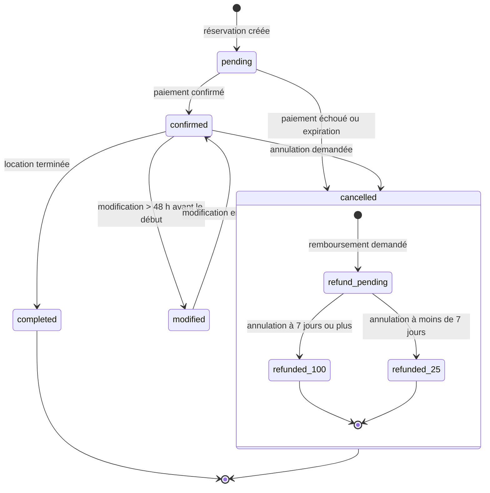

# CAHIER DES CHARGES - Your Car Your Way (V1.4)
*Objet : version allégée centrée sur l'analyse des besoins et les exigences fonctionnelles (C.1.1)*

---

## Objet

Ce document fournit la version minimale du cahier des charges requise pour l'évaluation C.1.1 : "Analyser les besoins pour définir les exigences fonctionnelles". Il contient les exigences fonctionnelles consolidées, les user stories prioritaires et leurs critères d'acceptation.

---

## Contexte

Your Car Your Way centralise plusieurs applications nationales hétérogènes. L'objectif ici est d'exprimer clairement les besoins métier prioritaires pour la première livraison fonctionnelle, afin que les développements et les tests d'acceptation puissent être alignés sur des exigences stables.

---

## Périmètre

Inclut : comptes utilisateurs, tchat entre clients et agents, recherche et réservation de véhicules, paiement via fournisseur externe, consultation historique, gestion basique des agences et véhicules, API pour intégration agence. Exclut : administration interne avancée, analytics, migration des bases legacy, aspects infra détaillés.

---

## Exigences fonctionnelles consolidées

Règles générales : identifiants en UUIDv4, timestamps ISO8601, formats JSON (schéma et contrats détaillés dans [API/openapi.yaml](API/openapi.yaml)).

- Gestion du compte
  - Créer un compte utilisateur avec email + mot de passe et confirmation par email.
  - Authentifier un utilisateur (login) et fournir un mécanisme de session (tokens).
  - Consulter et modifier son profil.
  - Supprimer son compte (confirmation par mot de passe).

- Recherche et consultation d'offres
  - Rechercher des offres par lieu, date/heure et catégorie de véhicule selon la norme ACRISS.
  - La classification véhicule s'appuie sur le code ACRISS à quatre caractères : catégorie, type de véhicule, transmission/traction et carburant/climatisation. La matrice officielle est consultable sur [ACRISS Car Codes](https://www.acriss.org/car-codes/).
  - Consulter le détail d'une offre (prix, disponibilité, agence de départ/retour).

- Réservation
  - Créer une réservation pour une offre disponible (statut initial : pending).
  - Règle de modification : possible si > 48h avant début.
  - Règle d'annulation : à partir de 7 jours inclus → 100% remboursé; moins de 7 jours → 25%.

- Paiement
  - Initier un paiement via un fournisseur externe (Stripe/PayPal) et recevoir confirmation via webhook.
  - Ne pas stocker les numéros de carte en clair.
  - Pour un fournisseur retenu, limiter les notifications souscrites aux événements nécessaires au cycle de vie du paiement et du remboursement.

- Historique
  - L'utilisateur peut consulter ses réservations passées et en cours.

- Tchat client-agent
  - Permettre à un client de créer et consulter une conversation avec le service client.
  - Permettre à un agent de consulter les conversations en attente, d'en prendre une en charge et de la libérer.
  - Permettre aux participants autorisés d'envoyer et de consulter les messages d'une conversation.
  - Notifier les nouveaux messages en temps réel sans exposer les données d'une autre conversation.

- Véhicules & Agences
  - Lire la liste des véhicules disponibles et les détails des agences, notamment leur ville, leur adresse et leurs horaires d'ouverture.
  - Exposer la classification ACRISS du véhicule et, pour les vans passagers, respecter le codage complémentaire lié au nombre de places.

- API agences
  - Fournir des endpoints sécurisés pour les applications d'agence dans le périmètre de la première livraison.

---

## **User stories et critères d’acceptation**

---
### **1. Gestion du compte**

#### **US-01 - Consultation du profil**
En tant que client disposant d’un compte, je veux consulter mon profil afin d’accéder à mes informations personnelles.

**Critères d’acceptation** :
- Étant donné un client disposant d’un compte, quand il accède à la page de profil, alors il peut consulter ses informations personnelles.
- Étant donné un client utilisant un lecteur d’écran, quand il consulte son profil, alors les informations sont vocalisées de manière claire.

---
#### **US-02 - Modification du profil**
En tant que client disposant d’un compte, je veux modifier mes informations personnelles afin de maintenir mon profil à jour.

**Critères d’acceptation** :
- Étant donné un client disposant d’un compte, quand il modifie son nom, son prénom, sa date de naissance ou son adresse depuis la page de profil, alors les nouvelles informations sont prises en compte.
- Étant donné un client naviguant au clavier, quand il modifie son profil, alors il peut atteindre et remplir tous les champs sans souris.

---
#### **US-03 - Suppression du compte**
En tant que client disposant d’un compte, je veux supprimer mon compte afin de ne plus utiliser le service.

**Critères d’acceptation** :
- Étant donné un client disposant d’un compte, quand il demande la suppression de son compte, alors la saisie de son mot de passe est requise.
- Étant donné un client naviguant au clavier ou à l’aide d’un lecteur d’écran, quand il demande la suppression de son compte, alors il peut comprendre l’action demandée, saisir son mot de passe et confirmer l’opération.

---
#### **US-14 - Création de compte** 
En tant que nouveau client, je veux créer un compte afin d’accéder aux fonctionnalités de réservation et de gestion de profil.

**Critères d’acceptation** :
- Étant donné un nouveau client, quand il remplit le formulaire de création de compte avec des informations valides (email, mot de passe, nom, prénom, date de naissance, adresse), alors son compte est créé et un email contenant un code d'activation lui est envoyé.
- Étant donné un nouveau client, quand son compte est créé, alors son statut initial est `pending` et un code temporaire à usage unique lui est envoyé par email.
- Étant donné un client avec un compte `pending`, quand il saisit un code valide et non expiré, alors son compte passe à `active` et il peut se connecter.
- Étant donné un client avec un compte `pending`, quand il saisit un code invalide, expiré ou déjà utilisé, alors son compte reste `pending` et un message d'erreur lui est présenté.
- Étant donné un client utilisant un lecteur d’écran, quand il remplit le formulaire de création de compte, alors tous les champs et messages d’erreur sont vocalisés.
- Étant donné un client naviguant au clavier, quand il remplit le formulaire, alors il peut atteindre et remplir tous les champs sans souris.
- Le mot de passe doit respecter des critères de complexité (ex. : 8 caractères minimum, 1 majuscule, 1 chiffre).

---
#### **US-15 - Authentification** 
En tant que client, je veux me connecter à mon compte afin d’accéder à mes réservations et à mon profil.

**Critères d’acceptation** :
- Étant donné un client avec un compte existant, quand il saisit son email et son mot de passe valides, alors il est authentifié et redirigé vers son espace personnel.
- Étant donné un client qui dépasse le seuil de tentatives de connexion défini par la politique de sécurité, alors les nouvelles tentatives sont temporairement limitées et un message compréhensible lui est présenté.
- Étant donné un client utilisant un lecteur d’écran, quand il se connecte, alors les messages d’erreur (ex. : mot de passe incorrect) sont vocalisés.

---
### **2. Gestion d’une location de voitures**

#### **US-04 - Consultation des agences**
En tant que client, je veux consulter la liste des agences de location afin d’identifier les points de départ et de retour disponibles.

**Critères d’acceptation** :
- Étant donné un client, quand il consulte les agences de location, alors la liste des agences est affichée avec leurs adresses et horaires.

---
#### **US-05 - Recherche d’offres de location**
En tant que client, je veux afficher les offres de location à partir de critères de recherche afin de trouver une offre adaptée à mon besoin.

**Critères d’acceptation** :
- Étant donné un client, quand il renseigne une ville de départ, une ville de retour, une date et une heure de début, une date et une heure de retour et une catégorie de véhicule ACRISS, alors les offres de location correspondantes sont affichées.
- Étant donné une recherche valide, quand les offres sont affichées, alors les résultats sont paginés et le nombre d’offres chargées initialement est limité afin de réduire les données transférées.
- Étant donné une recherche comportant plusieurs pages de résultats, quand le client demande une autre page, alors seuls les résultats de la page demandée sont chargés.
- Étant donné un client naviguant au clavier, quand il utilise le formulaire de recherche, alors il peut atteindre et renseigner tous les champs sans souris.
- Étant donné un client utilisant un lecteur d’écran, quand il utilise le formulaire de recherche, alors les champs, leurs libellés et les messages associés sont compréhensibles.

---
#### **US-06 - Consultation du détail d’une offre**
En tant que client, je veux consulter le détail d’une offre de location afin de vérifier qu’elle correspond à mon besoin.

**Critères d’acceptation** :
- Étant donné une offre de location, quand le client consulte son détail, alors il peut accéder aux informations de l’offre (prix, véhicule, dates, etc.).
- Étant donné un client utilisant un lecteur d’écran, quand il consulte le détail d’une offre, alors il peut accéder aux informations essentielles de l’offre de manière compréhensible.

---
#### **US-07 - Réservation d’une location**
En tant que client, je veux réserver une offre de location afin de confirmer ma location.

**Critères d’acceptation** :
- Étant donné une offre de location, quand le client effectue une réservation, alors il peut fournir ses informations personnelles.
- Étant donné une réservation, quand les informations du profil sont présentes, alors elles peuvent être récupérées depuis le profil.
- Étant donné une réservation, quand le client valide le parcours de paiement, alors le paiement est effectué via un fournisseur externe (Stripe, PayPal, etc.).
- Étant donné un client naviguant au clavier ou à l’aide d’un lecteur d’écran, quand il effectue une réservation, alors il peut comprendre les étapes du parcours, renseigner les informations demandées et identifier les actions à réaliser.

---
#### **US-08 - Consultation de l’historique des réservations**
En tant que client disposant d’une réservation, je veux consulter l’historique de mes réservations afin de retrouver mes réservations passées et en cours.

**Critères d’acceptation** :
- Étant donné un client disposant d’un compte, quand il consulte son historique, alors ses réservations passées et en cours sont affichées.
- Étant donné un client consultant son historique sans filtre personnalisé, quand la page est ouverte, alors les réservations des 30 derniers jours sont affichées par défaut et les résultats sont paginés.
- Étant donné un client consultant son historique, quand il souhaite retrouver une réservation plus ancienne, alors il peut élargir la période de recherche ou saisir une période personnalisée.
- Étant donné un client ayant choisi une période ou une page, quand il actualise la page, alors les critères de recherche sont conservés.
- Étant donné un client ayant modifié les critères de son historique, quand il réinitialise les filtres, alors l’application revient à la période et à la pagination par défaut.
- Étant donné un client naviguant au clavier ou à l’aide d’un lecteur d’écran, quand il consulte son historique, alors il peut parcourir ses réservations et distinguer les informations utiles sans dépendre d’un code couleur seul.

---
#### **US-09 - Modification d’une réservation**
En tant que client disposant d’une réservation, je veux modifier ma réservation afin de l’adapter à mon besoin dans le respect des règles prévues.

**Critères d’acceptation** :
- Étant donné une réservation, quand le client demande une modification **plus de 48h avant son début**, alors la modification est possible.
- Étant donné une réservation, quand le client demande une modification **moins de 48h avant son début**, alors la modification n’est pas possible et un message l’informe.

---
#### **US-10 - Annulation d’une réservation**
En tant que client disposant d’une réservation, je veux annuler ma réservation afin de renoncer à la location.

**Critères d’acceptation** :
- Étant donné une réservation, quand le client l’annule **à 7 jours ou plus de son début**, alors le remboursement est de **100%**.
- Étant donné une réservation, quand le client l’annule **à moins de 7 jours de son début**, alors le remboursement est limité à **25%** du montant total.

#### **Cycle de vie fonctionnel d’une réservation**

Le parcours ci-dessous synthétise les principaux états d’une réservation et les règles associées au paiement, à la modification et à l’annulation. Les statuts de paiement et de remboursement peuvent évoluer indépendamment du statut de la réservation.



Ce schéma est une vue fonctionnelle simplifiée : une demande de modification à moins de 48 heures est refusée et ne change pas l’état de la réservation.

---
### **3. Intégration avec les applications d’agence**

#### **US-11 - Consultation des données via API**
En tant qu’application utilisée en agence, je veux consulter les données traitées par l’application client afin d’exploiter les informations nécessaires en agence.

**Critères d’acceptation** :
- Étant donné une application utilisée en agence, quand elle appelle l’API dédiée avec un JWT valide, alors elle peut consulter les données des domaines concernés (utilisateurs, réservations, véhicules).

### **4. Internationalisation**

#### **US-13 - Affichage dans la langue de l’interface**
En tant que client, je veux consulter l’interface dans une langue adaptée afin de comprendre les informations, les labels et les actions affichées.

**Critères d’acceptation** :
- Étant donné un client utilisant une langue d’interface donnée (ex. : FR, EN), quand il consulte l’application, alors les labels et les textes affichés sont présentés dans cette langue.
- Étant donné un client utilisant une langue d’interface donnée, quand il consulte un formulaire ou un parcours, alors les messages, aides et informations affichées sont cohérents avec cette langue.
- Étant donné un client dont la langue préférée n’est pas disponible, quand il consulte l’application, alors l’interface est affichée dans la langue de repli définie par l’application (français).
- Étant donné un client ayant sélectionné une langue, quand il consulte une date, une heure ou un montant, alors la valeur est affichée selon les conventions locales de cette langue et de la devise concernée.
- Étant donné un client utilisant une langue prise en charge, quand une erreur ou une notification est affichée, alors son message est traduit dans la langue sélectionnée.

---
### **5. Intégration de composants tiers**

#### **US-17 - Échange sécurisé avec les services tiers**
En tant qu’utilisateur de l’application, je veux que les échanges avec les services tiers soient sécurisés et traçables afin que les paiements et les notifications externes soient traités de manière fiable.

**Critères d’acceptation** :
- Étant donné un client qui valide un paiement, quand l’application sollicite le fournisseur externe, alors seules les données nécessaires sont transmises et aucune donnée bancaire sensible n’est stockée par l’application.
- Étant donné un événement reçu d’un fournisseur externe, quand le webhook est transmis à l’API, alors sa signature et son horodatage sont vérifiés avant tout traitement.
- Étant donné un événement déjà traité, quand le même webhook est reçu plusieurs fois, alors il n’est pas traité une seconde fois et son identifiant est conservé pour assurer l’idempotence.
- Étant donné un webhook valide, quand l’événement est reçu, alors il est enregistré de manière idempotente avant le traitement métier long et l’API répond par un statut de succès afin de limiter les nouvelles tentatives du fournisseur.
- Étant donné un webhook invalide ou non authentifiable, quand l’API le reçoit, alors aucune mise à jour métier n’est exécutée et l’événement est journalisé sans exposer de secret.
- Étant donné un webhook PayPal lorsque PayPal est retenu, quand l’API reçoit une notification, alors elle conserve le corps brut et les éléments nécessaires à la vérification PayPal, notamment l’identifiant du webhook et les informations de transmission, avant toute désérialisation métier.
- Étant donné un webhook PayPal lorsque le flux Orders v2 / Payments v2 est retenu, alors les événements pris en charge sont explicitement définis parmi les événements d’autorisation, de capture et de remboursement nécessaires au parcours ; les autres événements ne sont pas traités implicitement.
- Étant donné une erreur ou une indisponibilité du fournisseur externe, quand l’échange échoue, alors l’application conserve un état cohérent, journalise l’erreur et informe l’utilisateur avec un message compréhensible.
- Étant donné un échange avec un service tiers, quand une clé, un secret ou un jeton est nécessaire, alors cette donnée n’est pas exposée dans le code source, les réponses API ou les journaux applicatifs.

---
### **6. Gestion de session accessible** 

#### **US-16 - Gestion de session avec refresh tokens**
En tant que client, y compris en situation de handicap, je veux que ma session soit prolongée automatiquement afin d’éviter les reconnexions fréquentes et de maintenir un accès fluide à l’application.

**Critères d’acceptation** :
- Étant donné un client connecté, quand son **access token** expire, alors un **refresh token** est utilisé automatiquement pour prolonger sa session sans interruption.
- Étant donné un client ayant une session valide, quand il ouvre l'application, alors sa session est restaurée automatiquement sans qu'il ait à saisir de nouveau ses identifiants.
- Étant donné un client utilisant un lecteur d’écran, quand sa session est prolongée, alors un message vocalisé l’informe (ex. : *"Votre session a été prolongée automatiquement").
- Étant donné un client naviguant au clavier, quand sa session est sur le point d’expirer, alors il peut prolonger la session en appuyant sur un bouton accessible (ex. : `Entrée` ou `Espace`).
- Étant donné un client, quand sa session expire définitivement, alors il est redirigé vers une page de reconnexion avec un message clair (ex. : *"Votre session a expiré. Veuillez vous reconnecter."*).
- Étant donné un client, quand il souhaite se déconnecter, alors un bouton **"Se déconnecter"** est disponible et accessible via le clavier ou un lecteur d’écran.

---

### **7. Tchat client-agent**

#### **US-18 - Échange entre un client et un agent**
En tant que client, je veux échanger avec un agent dans une conversation sécurisée afin d'obtenir de l'aide pendant mon parcours.

**Critères d’acceptation** :
- Étant donné un client authentifié, quand il ouvre le tchat, alors il peut créer une conversation ou consulter sa conversation active.
- Étant donné un client authentifié, quand il envoie un message, alors celui-ci est enregistré avec son auteur et sa date, puis affiché dans la conversation.
- Étant donné un agent authentifié, quand il consulte les conversations en attente, alors il peut prendre en charge une conversation et répondre au client.
- Étant donné un agent ayant pris en charge une conversation, quand il la libère, alors elle redevient disponible pour un autre agent et son historique est conservé.
- Étant donné un participant autorisé, quand un nouveau message est envoyé, alors il reçoit une notification en temps réel et ne peut accéder qu'aux conversations auxquelles il est autorisé.
- Étant donné un client ou un agent naviguant au clavier ou utilisant un lecteur d’écran, quand il utilise le tchat, alors les messages, champs, actions et notifications sont compréhensibles et accessibles.

---
### **8. Exigences transverses : impact écologique**

- Les échanges réseau doivent limiter les données transférées : réponses paginées, champs nécessaires uniquement et compression adaptée.
- Les recherches et historiques utilisent une pagination côté serveur et un périmètre initial limité. Les valeurs par défaut sont modifiables par l’utilisateur et ne constituent pas une restriction d’accès aux données.
- Les requêtes doivent éviter de charger l’intégralité d’un historique ou d’une liste lorsque seule une page de résultats est affichée.
- Les images de véhicules doivent être redimensionnées et servies dans un format adapté au contexte d’affichage.
- Les contenus statiques doivent pouvoir être mis en cache afin de limiter les traitements et transferts répétés.
- L’architecture doit privilégier un hébergement et des services d’infrastructure dont l’impact environnemental est documenté, dans la limite du budget et de la disponibilité régionale.
- Les choix d’architecture doivent être évalués selon leur coût fonctionnel, technique et environnemental ; les composants surdimensionnés sont exclus de la première livraison.

---
## Priorisation / Releases

- Lot préparatoire — Socle sécurisé préalable : US-14, US-15, US-16.
- Lot technique démontré par la PoC — Tchat client-agent : US-18.
- Release 1 — Périmètre de la première livraison : US-01, US-02, US-03, US-04, US-05, US-06, US-07.
- Release 2 : US-08, US-09, US-10, US-11, US-13, US-17.

## Definition of Ready (DoR) et Definition of Done (DoD) — Release 1 (MVP)

- **DoR (pour chaque US incluse dans la release)** :
  - US décrite et priorisée avec critère d'acceptation clair.
  - Mockups ou maquettes disponibles quand l'UI est concernée.
  - Schéma de l'API ou référence OpenAPI si l'API est impactée ([API/openapi.yaml](API/openapi.yaml)).
  - Données de test minimales et jeux de données anonymisés disponibles.
  - Dépendances identifiées (services externes, webhooks).

- **DoD (pour la clôture d'une US)** :
  - Tous les critères d'acceptation automatisés et manuels sont validés.
  - Tests unitaires et tests d'intégration couverts (coverage raisonnable selon le projet).
  - Tests end‑to‑end (parcours critiques) verts en CI pour la fonctionnalité.
  - OpenAPI mis à jour si l'API a été modifiée ([API/openapi.yaml](API/openapi.yaml)).
  - Cadre d'intégration webhook mis à jour si nécessaire ([API/webhook-integration-framework.md](API/webhook-integration-framework.md)).
  - Revue accessibilité : axe-core **critical** et **serious** issues résolues; tests contraste automatisés passés.
  - Documentation utilisateur/minimale et notes de release disponibles.
  - Merge request acceptée et pipeline CI verte.

## Traçabilité des artefacts

- Les artefacts techniques et contracts associés à ce CDC se trouvent dans le dépôt :
  - OpenAPI : [API/openapi.yaml](API/openapi.yaml)
  - Cadre d'intégration webhook : [API/webhook-integration-framework.md](API/webhook-integration-framework.md)
  - Proposition d'architecture : [Proposition-Architecture.md](Proposition-Architecture.md)
  - PoC et instructions : [PoC/README.md](PoC/README.md)

---

Version : V1.4 — contenu minimal fonctionnel pour C.1.1

---

## **Annexe : Charte couleur accessible & règles pour daltoniens**

Objectif : garantir que l'interface et les graphiques restent compréhensibles pour les personnes atteintes de déficiences de la vision des couleurs.

- Principe général : préférer une palette par défaut accessible, puis proposer un thème haute-contraste si nécessaire. Ne jamais transmettre d'information uniquement par la couleur.

- Palette recommandée (exemples testés daltonisme / ColorBrewer-like) :

```css
--color-primary: #2B6CB0; /* bleu */
--color-success: #3182CE; /* bleu-vert */
--color-info: #4FD1C5; /* turquoise clair */
--color-warning: #F6AD55; /* orange */
--color-danger: #D53F3A; /* rouge foncé - éviter seul contre --color-success */
--color-neutral-900: #1A202C; /* texte */
--color-neutral-100: #EDF2F7; /* fond */
```

- Tokens sémantiques à utiliser (exemples) :
  - `--bg-primary`, `--text-on-primary`, `--border-success`, `--icon-warning`.

- Chartes graphiques et charts :
  - éviter les paires rouge/vert sans distinction ; préférer combinaisons bleu/orange/teal.
  - ajouter motifs (hatch, pointillés) et labels directs sur les séries.
  - fournir une légende textuelle et un tableau de données alternatif sous le graphique.

- Indicateurs UI :
  - toujours associer icône + texte pour statuts (ex. Confirmé, En attente, Annulé) afin d'éviter la dépendance exclusive à la couleur.
  - pour erreurs/validation, utiliser bordures, icônes et messages textuels explicites.

- Thèmes & préférences utilisateurs :
  - proposer un thème "Haute-contraste" et un mode "Daltonien" activables en settings.
  - respecter la préférence système `prefers-contrast` quand possible.

- Tests et outils recommandés :
  - Chrome DevTools (Rendering → Emulate color vision deficiency), Color Oracle, Sim Daltonism.
  - Intégrer `axe-core` / `axe-core` CI checks et tests contrast dans la pipeline (ex. axe + pa11y/lighthouse).

- Règles d'acceptation (DoD pour accessibilité couleurs) :
  - Tous les textes et éléments interactifs respectent contraste ≥ 4.5:1.
  - Aucune information métier clé n'est transmise uniquement par la couleur.
  - Les graphiques proposent une alternative textuelle ou tableau.
  - Les composants principaux (boutons, badges, statuts) ont des icônes et libellés associés.

Cette annexe doit être reprise dans la charte graphique finale et appliquée aux composants du frontend (design tokens, storybook, guidelines de QA).

### Accessibilité pour malvoyants / basse vision et lecteurs d'écran

Objectif : garantir l'accès aux utilisateurs malvoyants (basse vision) et aux utilisateurs de lecteurs d'écran (NVDA, VoiceOver, JAWS) par des règles simples, techniques et vérifiables.

Principes et règles pratiques :
- Utiliser HTML sémantique (landmarks, headings, lists) ; compléter par ARIA uniquement quand le rôle natif n'est pas disponible.
- Tous les contrôles interactifs disposent d'un label clair et lié (élément `<label for>` ou `aria-labelledby` / `aria-label`). Éviter les libellés ambigus ou les formulations du type "cliquez ici".
- Fournir des textes alternatifs descriptifs pour les images (`alt`) ; les images décoratives utiliseront `alt=""`.
- Associer les messages d'erreur aux champs concernés via `aria-describedby` et placer le focus sur le premier champ en erreur lors de la soumission.
- Pour les mises à jour dynamiques (ex. : confirmation de paiement, prolongation de session), utiliser `aria-live` (polite/assertive selon criticité) afin que le lecteur d'écran annonce l'événement.
- Garantir un ordre de lecture logique (DOM order) identique à l'ordre visuel ; éviter les éléments positionnés hors flux qui cassent la navigation linéaire.
- Navigation clavier complète : tous les éléments interactifs accessibles au clavier, visible focus, et présence d'un lien "Skip to content".
- Modal et changements de contexte : trap focus à l'ouverture et retour du focus au déclencheur à la fermeture.

Tests recommandés et DoD mesurables (acceptation) :
- Audit automatique : aucun `critical` ou `serious` dans `axe-core` sur les parcours critiques (login, réservation, paiement, profil).
- Tests manuels : parcours critiques validés avec NVDA (Windows) et VoiceOver (macOS) — lecture des libellés, erreurs et messages dynamiques.
- Labels : 100% des éléments de formulaires et contrôles ont un label accessible vérifié par script (ex. testing-library/accessibility-checker) et revue manuelle.
- Messages dynamiques : confirmations et erreurs importantes annoncées via `aria-live` et vérifiées manuellement.
- Navigation clavier : parcours end-to-end possible sans souris ; focus visible et logique.
- Rapport de conformité accessible inclus dans la MR/PR (notes QA + tests exécutés).

Ces règles complètent les règles de la charte couleur ; elles doivent être appliquées sur tous les composants UI et vérifiées dans la revue d'accessibilité avant acceptation.
