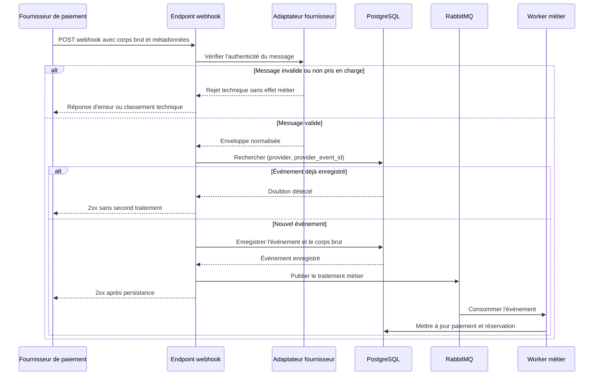
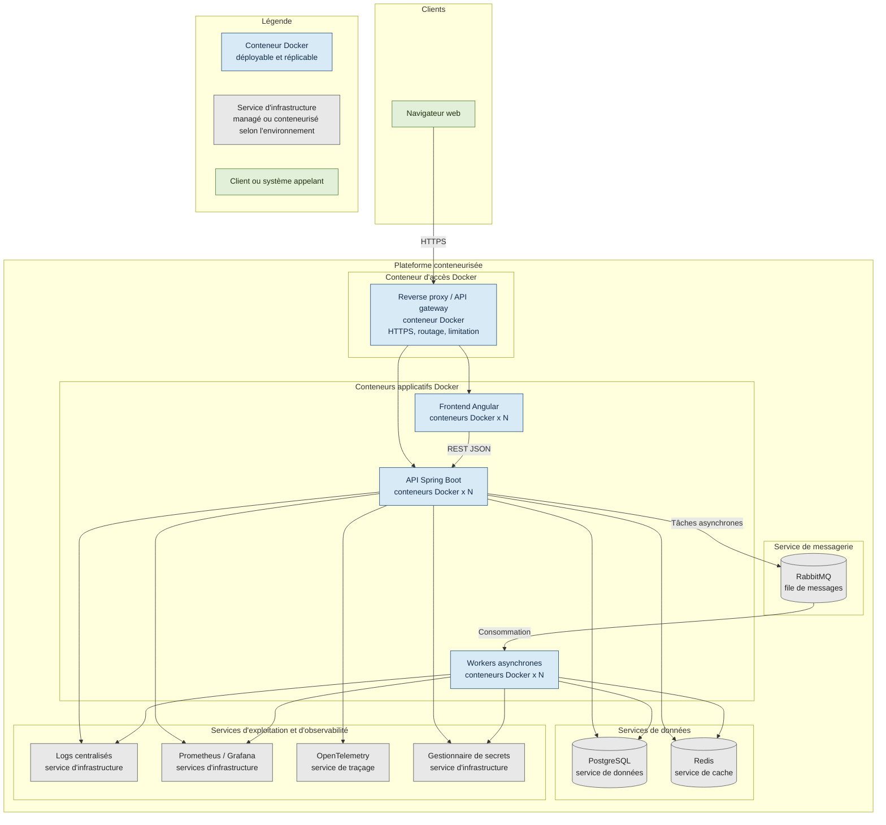
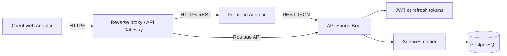
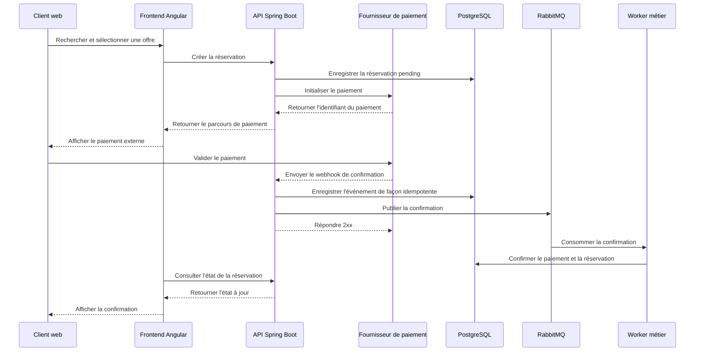
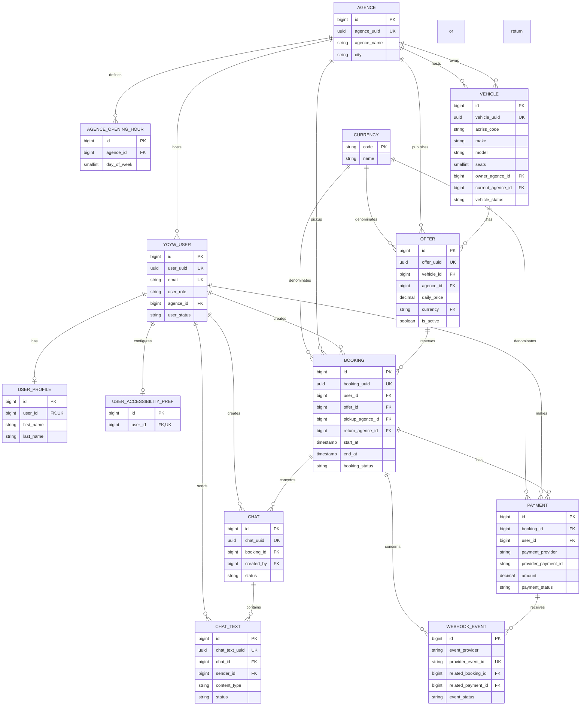
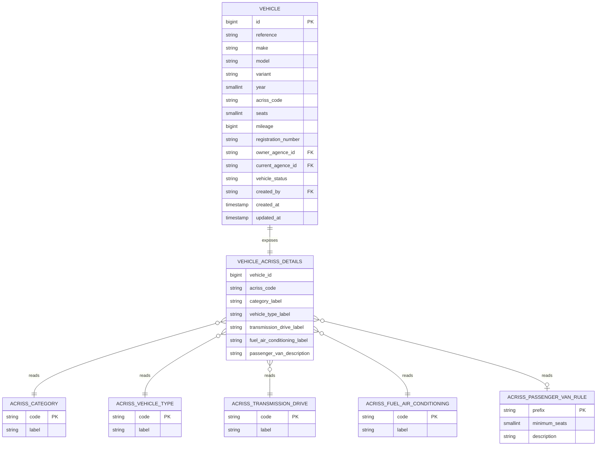
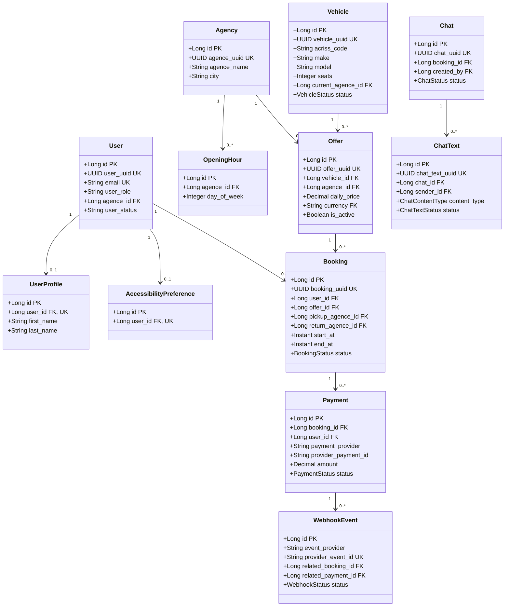
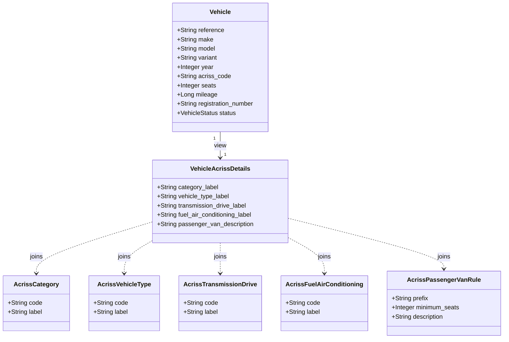
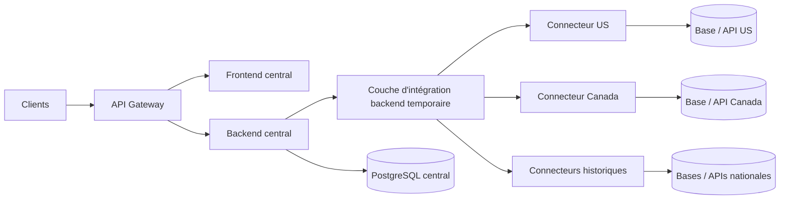
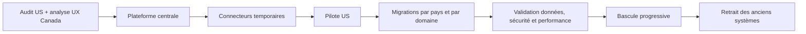

# Proposition d'architecture

## Sommaire

1. [Orientation stratégique](#1-orientation-stratégique)
  - [1.1 Audit ciblé des versions existantes](#11-audit-ciblé-des-versions-existantes)
  - [1.2 Critères de décision](#12-critères-de-décision)
2. [Architecture cible](#2-architecture-cible)
  - [2.1 Technologies retenues](#21-technologies-retenues)
  - [2.2 Intégrations et services tiers](#22-intégrations-et-services-tiers)
  - [2.3 Principes d'architecture](#23-principes-darchitecture)
  - [2.4 Schéma des briques](#24-schéma-des-briques)
  - [2.5 Flux applicatif](#25-flux-applicatif)
  - [2.6 Modèle de données](#26-modèle-de-données)
  - [2.7 Vue UML du domaine](#27-vue-uml-du-domaine)
3. [Comparaison et justification des choix](#3-comparaison-et-justification-des-choix)
  - [3.1 Tableau de comparaison](#31-tableau-de-comparaison)
  - [3.2 Solutions de paiement non retenues](#32-solutions-de-paiement-non-retenues)
4. [Spécifications transverses](#4-spécifications-transverses)
  - [4.1 Sécurité, sessions et accessibilité](#41-sécurité-sessions-et-accessibilité)
  - [4.2 Exigences non fonctionnelles](#42-exigences-non-fonctionnelles)
  - [4.3 Formats et contrats](#43-formats-et-contrats)
5. [PoC actuelle](#5-poc-actuelle)
6. [Stratégie de migration](#6-stratégie-de-migration)
  - [6.1 Principes de migration](#61-principes-de-migration)
  - [6.2 Étapes de migration](#62-étapes-de-migration)
  - [6.3 Schémas de coexistence et de migration](#63-schémas-de-coexistence-et-de-migration)
7. [Prochaines étapes](#7-prochaines-étapes)

## 1. Orientation stratégique

### 1.1 Audit ciblé des versions existantes

Avant de figer l'architecture et de lancer les travaux de migration, un audit ciblé doit être mené sur deux actifs existants :

- **Version américaine :** vérifier si son architecture, son code, ses interfaces, son modèle de données, ses mécanismes de sécurité et son mode de déploiement peuvent être réutilisés pour la plateforme centralisée. Si elle répond aux exigences fonctionnelles, techniques et réglementaires, sa conservation permettrait de réduire le périmètre de migration, les coûts, les risques et les délais. La décision devra toutefois être fondée sur des preuves et non sur la seule modernité de la stack.
- **Frontend canadien :** analyser les parcours, les composants d'interface, la navigation, la lisibilité, l'accessibilité et les éléments ayant contribué aux retours positifs des utilisateurs. Les enseignements utiles pourront être repris dans l'interface cible, même si le code canadien n'est pas conservé.

Les éléments actuellement disponibles distinguent les deux sujets : la version américaine présente les meilleurs indicateurs opérationnels de l'existant, tandis que le frontend canadien est associé aux retours UX les plus favorables. L'audit devra confirmer ces constats et identifier précisément ce qui peut être conservé, adapté ou écarté.

### 1.2 Critères de décision

La décision de conserver, adapter ou remplacer une version existante sera prise selon les critères suivants :

- couverture des exigences fonctionnelles communes et internationales ;
- compatibilité avec le modèle de données centralisé et les APIs harmonisées ;
- niveau de sécurité, gestion des secrets et conformité ;
- maintenabilité, testabilité et capacité d'évolution ;
- accessibilité et qualité des parcours utilisateurs ;
- coût, durée et risque de migration ;
- compatibilité avec la cible de déploiement, l'observabilité et les composants tiers.

La stratégie cible privilégie donc la réutilisation de l'existant lorsqu'elle est démontrée, tout en conservant la possibilité de remplacer les composants qui ne répondent pas aux exigences de la plateforme centralisée.

## 2. Architecture cible

Cette section décrit l'état final visé après la migration. Les applications historiques, leurs connecteurs et les mécanismes de coexistence sont temporaires : ils sont décrits dans la stratégie de migration et ne constituent pas des dépendances permanentes de la cible.

### 2.1 Technologies retenues

#### 2.1.1 Choix technologiques actés

- **Frontend**
  - Angular 21 + TypeScript.
  - Traduction gérée par les ressources de l'application.
- **Backend**
  - Java 21 + Spring Boot 3.2.
  - API REST structurée et validation des entrées.
- **API**
  - REST JSON avec OpenAPI 3.0.
  - JWT pour les utilisateurs web, selon le mode d'authentification retenu.
- **Base de données et cache**
  - Base SQL.
    - PostgreSQL comme base relationnelle avec schéma normalisé.
  - Redis pour le cache et les données temporaires de session.
- **Accès et répartition**
  - Reverse proxy / API Gateway conteneurisé.
  - Terminaison HTTPS, routage, health checks et répartition de charge vers les instances applicatives.
- **Traitements asynchrones**
  - RabbitMQ comme file de messages.
  - Workers Spring Boot conteneurisés et réplicables indépendamment de l'API.
- **Authentification et sécurité**
  - JWT à courte durée de vie et refresh tokens.
  - Secrets stockés dans un vault (Azure Key Vault / AWS Secrets Manager).
- **Paiement**
  - Stripe et PayPal avec webhooks sécurisés.
  - Stockage minimal des données de paiement, sans cartes en clair.
- **Déploiement**
  - Conteneurs Docker orchestrés par Kubernetes (EKS/AKS) ou exécutés sur App Services selon le périmètre.
  - CI/CD avec GitHub Actions.
- **Observabilité**
  - Logs centralisés.
  - Métriques Prometheus visualisées dans Grafana et traces distribuées avec OpenTelemetry.

#### 2.1.2 Justification des choix

- **Frontend :** Angular est retenu pour structurer une interface web TypeScript maintenable, compatible avec les exigences d'accessibilité, d'internationalisation et de tests du projet.

- **Backend :** Spring Boot et Java 21 sont retenus pour structurer une API REST robuste, avec validation des entrées, gestion de la sécurité, prise en charge des transactions métier et outillage de tests adapté.

- **API :** REST JSON et OpenAPI 3.0 sont retenus pour formaliser les échanges, faciliter l'intégration des clients et documenter le contrat d'API.

- **Intégration des systèmes existants :** Les APIs nationales étant limitées, hétérogènes et non unifiées, des connecteurs temporaires permettront d'intégrer progressivement les systèmes existants sans exposer directement leurs bases au frontend.

- **Base de données et cache :**
  - **Choix SQL :** Une base SQL est retenue comme source de vérité principale plutôt qu'une base NoSQL, car le domaine comporte de nombreuses relations entre utilisateurs, agences, véhicules, offres, réservations et paiements. Les transactions ACID, les contraintes d'intégrité référentielle et la normalisation 3NF sont nécessaires pour garantir la cohérence des données métier et éviter les doublons.

    - **Alternative NoSQL :** MongoDB, Cassandra ou DynamoDB pourraient répondre à des besoins documentaires, distribués ou fortement scalables. Ils sont toutefois moins adaptés au modèle principal, car leurs mécanismes de relations et de contraintes référentielles sont moins naturels pour les transactions multi-entités nécessaires à une réservation et à son paiement.

  - **PostgreSQL :** PostgreSQL est retenu parmi les bases SQL pour ses fonctionnalités SQL avancées, sa gestion des contraintes, ses transactions ACID et sa bonne adéquation avec le modèle métier strictement normalisé.

    - **Alternatives SQL :** MySQL ou MariaDB pourraient couvrir une grande partie du besoin relationnel. Ils restent techniquement possibles, mais PostgreSQL est privilégié pour ses fonctionnalités avancées et sa bonne adéquation avec les contraintes du modèle retenu.

  - **Cache :** Redis est retenu uniquement pour le cache et les données temporaires de session afin de réduire la charge sur PostgreSQL ; il ne remplace pas la base relationnelle source de vérité.

- **Accès et répartition :** Un reverse proxy / API Gateway est retenu comme point d'entrée HTTPS pour protéger les conteneurs internes, router les requêtes et répartir la charge vers les instances frontend et backend disponibles.

- **Traitements asynchrones :** RabbitMQ est retenu pour découpler les traitements asynchrones de l'API. La file permet d'absorber les pics, de réessayer les tâches en erreur et de faire évoluer le nombre de workers indépendamment du nombre d'instances API.

- **Authentification et sécurité :** Les JWT à courte durée de vie, les refresh tokens et le stockage des secrets dans un vault sont retenus pour sécuriser les accès et limiter l'exposition des informations sensibles.

- **Paiement :** Stripe et PayPal sont retenus comme fournisseurs de paiement externalisé complémentaires. Stripe permet notamment le paiement par carte bancaire et la gestion de moyens de paiement numériques via une intégration structurée, tandis que PayPal répond aux utilisateurs souhaitant payer depuis leur portefeuille PayPal.

  Les deux solutions fournissent des APIs, des SDKs et des mécanismes de notification permettant de confirmer les paiements sans stocker les numéros de carte dans l'application. Pour PayPal, le cadrage s'appuie sur Orders v2, Payments v2 et Webhooks Management v1 ; le périmètre exact des APIs et événements sera confirmé lors du choix du flux de première livraison.

- **Déploiement :** Les conteneurs Docker orchestrés par Kubernetes ou exécutés sur App Services, avec une chaîne CI/CD GitHub Actions, permettent de déployer et de faire évoluer les composants de manière reproductible.

- **Observabilité :** Prometheus, Grafana, les logs centralisés et OpenTelemetry sont retenus pour suivre séparément les performances de l'API, la consommation de la file, les traitements des workers et les erreurs de l'ensemble de la plateforme.

### 2.2 Intégrations et services tiers

#### 2.2.1 Paiement et notifications

- Le backend transmet uniquement les données nécessaires aux fournisseurs de paiement ; le frontend ne les appelle pas directement et aucune donnée bancaire sensible n'est stockée.

- Chaque fournisseur est intégré derrière un adaptateur dédié qui traduit ses événements vers l'enveloppe interne normalisée définie dans le contrat webhook.

- Pour PayPal, l'adaptateur prend en charge les notifications du flux retenu parmi Orders v2 / Payments v2, notamment les événements d'autorisation, de capture et de remboursement. Les événements sont identifiés par leur `event_type` et leur identifiant d'événement ; la ressource PayPal embarquée et sa version sont conservées pour permettre le rapprochement avec le paiement interne.

- Le périmètre PayPal initial à étudier couvre `PAYMENT.AUTHORIZATION.CREATED`, `PAYMENT.AUTHORIZATION.VOIDED`, `PAYMENT.CAPTURE.COMPLETED`, `PAYMENT.CAPTURE.DECLINED`, `PAYMENT.CAPTURE.PENDING`, `PAYMENT.CAPTURE.REFUNDED`, `PAYMENT.CAPTURE.REVERSED`, `PAYMENT.REFUND.PENDING` et `PAYMENT.REFUND.FAILED`. `CHECKOUT.ORDER.APPROVED` peut être utilisé pour suivre l'approbation du parcours Orders v2, mais ne constitue pas à lui seul une confirmation de paiement capturé.

- Pour PayPal, l'authenticité est vérifiée à partir des informations de transmission fournies par PayPal, notamment l'identifiant de transmission, l'heure de transmission, l'URL du certificat, l'algorithme et la signature, ainsi que l'identifiant du webhook configuré. La vérification peut être effectuée localement avec le certificat PayPal ou via l'endpoint officiel de vérification ; le corps HTTP brut est conservé pour éviter une altération du contenu signé.

- Les webhooks entrants sont vérifiés par le mécanisme propre à chaque fournisseur, puis dédupliqués avec le couple fournisseur / identifiant d'événement.

- Après vérification et enregistrement idempotent en base, l'API répond rapidement par un statut `2xx` ; la mise à jour métier et les traitements rejouables sont exécutés de manière asynchrone par RabbitMQ et les workers. Les nouvelles tentatives du fournisseur ne doivent donc pas provoquer de double traitement.

- Les événements invalides, non authentifiables ou non pris en charge sont rejetés ou classés sans effet métier, avec une journalisation technique ne contenant aucun secret.

- Les erreurs du fournisseur sont journalisées sans secret, conservées dans un état métier cohérent et présentées à l'utilisateur avec un message compréhensible.

- Les clés et jetons sont fournis par des variables d'environnement ou un gestionnaire de secrets, jamais par le code source.

##### Séquence de réception et de vérification d’un webhook

Cette séquence détaille le traitement technique commun aux fournisseurs. La vérification d'authenticité reste spécifique à chaque adaptateur ; l'enregistrement idempotent précède les traitements métier asynchrones.

#### 2.2.2 Sobriété numérique et impact écologique

- Les réponses API sont paginées et limitées aux champs nécessaires afin de réduire les échanges réseau.
- Les endpoints de recherche et d’historique utilisent une pagination côté serveur. La taille de page par défaut est fixée à 25 éléments et la taille maximale est plafonnée à 100 éléments.
- L'historique utilise une période par défaut de 30 jours, que le client peut élargir explicitement avec des filtres de période. Cette valeur par défaut optimise les échanges sans limiter l'accès fonctionnel aux réservations plus anciennes.
- Les recherches ne retournent que les champs nécessaires à la liste ; les détails complets d'une offre ou d'une réservation sont chargés séparément lors de la consultation de l'élément.
- Les paramètres de recherche, de période, de tri et de pagination sont conservés dans l'URL ou dans un état de navigation afin qu'un rafraîchissement de page restaure la recherche en cours.
- Les images de véhicules sont redimensionnées, compressées et servies dans un format adapté au contexte d'affichage.
- Les contenus statiques sont mis en cache lorsque cela est pertinent.
- L'hébergement et les services sont choisis en tenant compte de leur impact environnemental documenté et du dimensionnement réel de la première livraison.

### 2.3 Principes d'architecture

- Le frontend Angular consomme l'API REST Spring Boot via le reverse proxy / API Gateway et HTTPS.

- Le reverse proxy / API Gateway constitue le point d'entrée HTTPS, effectue le routage et répartit les requêtes vers les instances frontend et backend disponibles.

- Le backend sépare les contrôleurs REST, les services métier, les accès aux données et les adaptateurs de services externes.

- Les tâches longues ou rejouables sont publiées dans RabbitMQ puis consommées par des workers indépendants ; le nombre de workers peut évoluer séparément du nombre d'instances API.

- PostgreSQL est la source de vérité pour les comptes, offres, réservations, paiements, webhooks et données du tchat.

- Redis sert à accélérer les accès aux données temporaires et ne remplace pas PostgreSQL pour les données métier.

- Les fournisseurs de paiement sont appelés uniquement par le backend ; leurs événements entrants passent par le contrat webhook avant mise à jour du domaine. Aucun autre système métier externe n'est une dépendance permanente de la cible.

### 2.4 Schéma des briques

Ce schéma présente une première vue de composition de l'ensemble final. Les blocs portant la mention « conteneur Docker » correspondent aux composants applicatifs déployables et réplicables. PostgreSQL, Redis, RabbitMQ et les outils d'exploitation sont représentés comme des services d'infrastructure ; ils pourront être hébergés en services managés ou déployés en conteneurs selon l'environnement retenu.

### 2.5 Flux applicatif

#### Séquence fonctionnelle d’une réservation avec paiement externe

Cette vue complète le flux applicatif en montrant l'ordre métier d'une réservation, depuis la sélection de l'offre jusqu'à la confirmation reçue du fournisseur de paiement.

### 2.6 Modèle de données

#### 2.6.1 Vue d'ensemble

#### 2.6.2 Sous-modèle ACRISS et vue de lecture

Le sous-modèle ACRISS est présenté séparément afin de ne pas alourdir le modèle métier principal. Les tables ACRISS sont des référentiels ; elles ne sont pas reliées par des clés étrangères persistées directement dans `VEHICLE`. Le trigger valide les quatre caractères de `acriss_code`, et la vue reconstruit les informations lisibles par jointure.

`VEHICLE_ACRISS_DETAILS` est une vue de lecture non persistée. Elle reconstruit les libellés ACRISS à partir des quatre positions de `VEHICLE.acriss_code` et applique la règle de capacité des vans passagers sans dupliquer ces données dans `VEHICLE`.

### 2.7 Vue UML du domaine

#### 2.7.1 Vue d'ensemble

#### 2.7.2 Sous-modèle UML ACRISS et vue de lecture

## 3. Comparaison et justification des choix

### 3.1 Tableau de comparaison

| Besoin | Solution retenue | Alternatives considérées | Justification |
|---|---|---|---|
| Interface web accessible | Angular + TypeScript | React, Vue | Typage strict, structure adaptée à une application métier durable et prise en charge des exigences d'accessibilité, d'internationalisation et de tests. |
| API métier | Spring Boot + Java 21 | Node.js/NestJS, .NET | Validation des entrées, sécurité, transactions métier, structuration claire des couches et outillage de tests adapté. |
| Persistance transactionnelle | PostgreSQL | MySQL, MariaDB, MongoDB, Cassandra, DynamoDB | SQL est retenu comme modèle principal pour les transactions ACID, les contraintes d'intégrité référentielle et la normalisation stricte. PostgreSQL est privilégié parmi les bases SQL pour ses fonctionnalités avancées et son adéquation avec le modèle métier. MySQL et MariaDB restent techniquement possibles. MongoDB, Cassandra et DynamoDB pourraient répondre à des besoins documentaires, distribués ou fortement scalables, mais sont moins adaptés aux relations et aux transactions multi-entités du modèle principal. |
| Cache et sessions temporaires | Redis | Cache en mémoire de l'API, Memcached | Réduit la charge sur PostgreSQL et accélère l'accès aux données temporaires. Redis est retenu pour ses structures de données et ses possibilités de gestion d'expiration ; il ne contient pas la source de vérité métier. |
| Traitements asynchrones | RabbitMQ + workers Spring Boot | Traitement synchrone dans l'API, Kafka, service de file cloud | Découple les tâches longues ou rejouables de la réponse HTTP, absorbe les pics et permet de faire évoluer les workers indépendamment de l'API. Kafka ou une file cloud restent possibles, mais seraient plus complexes ou dépendants d'un fournisseur pour le besoin actuel. |
| Accès et répartition de charge | Reverse proxy / API Gateway | Accès direct aux conteneurs, load balancer cloud seul | Fournit un point d'entrée HTTPS, le routage, les health checks et la répartition vers les instances disponibles, sans exposer directement les conteneurs applicatifs. |
| Paiement | Stripe et PayPal avec webhooks | Adyen, Mollie, Braintree, Checkout, Worldline, paiement bancaire interne | Stripe est retenu pour le paiement par carte et son intégration structurée par API/webhooks. PayPal est retenu comme moyen complémentaire pour les utilisateurs disposant d'un portefeuille PayPal. Les deux solutions réduisent le périmètre de conformité et évitent le stockage des données bancaires sensibles. |
| Session | JWT court + refresh token | Session serveur seule | Compatible avec l'API et permet une prolongation contrôlée de session. Le renouvellement automatique limite les reconnexions et les manipulations répétées, ce qui contribue à l'accessibilité des personnes en situation de handicap, notamment lors d'une navigation au clavier ou avec un lecteur d'écran, tout en conservant une durée de vie courte pour le JWT et un mécanisme sécurisé de renouvellement. |
| Déploiement | Docker et orchestration Kubernetes ou service managé | Déploiement manuel sur serveur | Isole les composants, permet la réplication horizontale de l'API et des workers, et facilite les déploiements reproductibles. L'orchestrateur gère le placement, les health checks et l'augmentation du nombre d'instances. |
| Observabilité | Prometheus, Grafana, logs centralisés et OpenTelemetry | Fichiers de logs locaux et supervision manuelle | Centralise les logs, mesure les performances et permet de corréler une requête API avec les traitements asynchrones et les erreurs de la plateforme. |
| Gestion des secrets | Azure Key Vault ou AWS Secrets Manager | Secrets dans le code ou les fichiers d'image Docker | Évite d'exposer les clés, mots de passe et jetons dans le dépôt ou les images ; les secrets sont injectés au runtime selon l'environnement. |

### 3.2 Solutions de paiement non retenues à ce jour

Les solutions suivantes sont connues et techniquement envisageables, mais elles ne sont pas retenues dans le périmètre actuel :

- **Adyen** : couverture internationale et nombreux moyens de paiement, mais solution plus complète et plus complexe que nécessaire pour le périmètre actuel.
- **Mollie** : bonne couverture des moyens de paiement européens, mais le besoin est déjà couvert par l'association Stripe et PayPal.
- **Braintree** : solution de l'écosystème PayPal permettant de gérer plusieurs moyens de paiement, mais elle ajouterait une couche de choix alors que PayPal est déjà retenu directement.
- **Checkout** : solution adaptée aux volumes importants et aux besoins internationaux, mais surdimensionnée pour le périmètre actuel.
- **Worldline** : acteur reconnu des paiements européens, mais non retenu à ce stade en raison d'une intégration et d'un périmètre commercial plus spécifiques.
- **Klarna** : paiement différé ou fractionné, mais non requis par les besoins fonctionnels actuels.
- **Apple Pay et Google Pay** : moyens de paiement complémentaires et non fournisseurs principaux ; ils pourront être activés ultérieurement via Stripe si le besoin est confirmé.
- **Virement ou prélèvement SEPA** : non retenus car ils ne garantissent pas nécessairement une confirmation immédiate adaptée à la réservation d'un véhicule.

## 4. Spécifications transverses

### 4.1 Sécurité, sessions et accessibilité

- Les échanges API utilisent OpenAPI 3.0, JSON, des dates ISO 8601 UTC et des devises ISO 4217.

- Les utilisateurs web sont authentifiés par JWT ; les droits sont définis selon leur rôle et leur périmètre métier. Les seuls échanges métier externes prévus concernent les fournisseurs de paiement.

- Le JWT d'accès a une durée de vie courte, fixée à 15 minutes en production. Il peut être transmis dans l'en-tête `Authorization: Bearer` ou, pour les clients web, dans un cookie `access_token` `HttpOnly`, `Secure` et `SameSite=Lax`.

- Le refresh token est un jeton opaque stocké dans un cookie `HttpOnly`, `Secure` et `SameSite=Lax`, limité au chemin `/api/auth`. Sa durée de vie est de 30 jours en production et sa valeur n'est jamais stockée en clair en base.

- Chaque renouvellement vérifie le hash du refresh token, supprime le jeton présenté et émet un nouveau refresh token. La déconnexion révoque le refresh token en base et supprime les cookies d'accès et de renouvellement.

- Les requêtes qui utilisent l'authentification par cookie sont protégées contre la CSRF : `GET /api/auth/csrf` initialise le cookie `XSRF-TOKEN` et expose sa valeur dans un en-tête de réponse ; le client la renvoie dans l'en-tête `X-XSRF-TOKEN` pour les requêtes non sûres.

- Les mots de passe, tokens et secrets ne sont jamais stockés en clair ni écrits dans les journaux.

- Les parcours login, réservation, paiement et profil doivent respecter les critères d'accessibilité du CDC et être vérifiés par axe-core et des tests clavier/lecteur d'écran.

### 4.2 Exigences non fonctionnelles

- Disponibilité (SLA cible) : 99.9% (MTBF/MTTR planifiés) — baseline fournie dans `Contexte`.

- Objectifs d'exploitation (SLO)
  - P95 latence API: < 300 ms
  - P99 latence API: < 800 ms
  - Taux d'erreur à fort trafic: < 1%
  - Capacité cible (global, dimensionnement initial) : 1 500 requêtes/s soutenues
  - MTTR objectif: < 1 heure

- Pagination et collections : les endpoints de recherche et d'historique acceptent `page` et `pageSize`, utilisent une taille de page par défaut de 25 éléments et refusent une taille supérieure à 100 éléments.

- Les collections sont triées de manière déterministe ; l'historique des réservations est trié par date de début décroissante par défaut.

- Les filtres de période sont transmis à l'API afin d'éviter le chargement de données inutiles avant filtrage côté frontend.

- Sécurité: TLS 1.2+ (préférer 1.3), cookies HttpOnly+Secure, rotation automatique des secrets.

### 4.3 Formats et contrats

- OpenAPI 3.0 pour endpoints publics et internes.
- Payloads JSON, dates en ISO8601 UTC, devises en ISO 4217.
- Les réponses de collection sont structurées autour d'une liste `items` et de métadonnées de pagination, notamment `page`, `pageSize`, `totalItems` et `totalPages` lorsque le calcul du total est pertinent.
- Les paramètres de recherche sont restaurables après actualisation lorsqu'ils sont présents dans l'URL. Une action explicite de réinitialisation restaure les valeurs par défaut.
- Webhook contract: authentification et signature propres à chaque fournisseur, horodatage lorsque le fournisseur en fournit un, enveloppe interne normalisée et idempotence via le couple `provider` / `provider_event_id`.

## 5. PoC actuelle

La PoC actuelle valide le parcours fonctionnel du tchat, et non l'ensemble de la plateforme cible. Elle sert de preuve technique pour le dialogue entre un client et un agent, la persistance des conversations et la gestion des droits.

### Périmètre fonctionnel

- création et consultation d'une conversation ;
- authentification client et agent ;
- envoi et lecture des messages ;
- prise en charge d'une conversation par un agent ;
- libération et reprise d'une conversation ;
- clôture côté client ;
- diffusion des messages et changements d'état par SSE ;
- contrôle des droits côté frontend et backend, notamment pour les conversations attribuées à un autre agent.

### Réalisation technique

| Couche | Réalisation actuelle |
| --- | --- |
| Frontend | Angular 21, TypeScript, RxJS, composants autonomes et signaux |
| Backend | Java 21, Spring Boot 3.2, Spring MVC, Spring Data JPA et Spring Security |
| Données | PostgreSQL, scripts SQL d'initialisation et entités JPA |
| Authentification | JWT dans des cookies HttpOnly, refresh token et protection CSRF |
| Temps réel | SSE avec `SseEmitter` côté backend et `EventSource` côté frontend |
| Tests | Jest, Cypress, JUnit, tests Spring Boot et Mockito |
| Exécution locale | Backend sur `localhost:8080`, frontend Angular sur `localhost:4200`, proxy `/api` |

La PoC propose aussi un mode mock Angular pour tester l'interface sans PostgreSQL ni backend. Le détail des commandes, des routes, des comptes de démonstration, des statuts et des scénarios de validation est disponible dans [PoC/README.md](../PoC/README.md).

### Limites par rapport à la cible

La PoC ne réalise pas encore les parcours de réservation, de paiement ou de gestion complète des véhicules. Elle n'intègre pas non plus Redis, RabbitMQ, Docker, Kubernetes, une passerelle API de production ou une chaîne d'observabilité complète. Ces éléments relèvent de la cible ou de son déploiement futur, pas de la preuve fonctionnelle actuelle.

## 6. Stratégie de migration

La stratégie de migration décrit le chemin temporaire permettant d'intégrer les données et l'historique des applications existantes dans la plateforme cible. Les connecteurs, adaptateurs et mécanismes de coexistence présentés ici sont supprimés ou désactivés après la migration et ne font pas partie de l'architecture finale.

### 6.1 Principes de migration

La migration sera progressive afin de limiter les risques et d'éviter une bascule simultanée de toutes les applications nationales.

La nouvelle plateforme sera mise en place à côté des systèmes existants, puis les fonctionnalités seront transférées par étapes selon leur niveau de maturité et les résultats observés.

Une couche d'adaptation temporaire sera placée au plus près des bases et APIs nationales. Elle prendra la forme de connecteurs backend dédiés, chargés de lire les anciens formats, de les traduire vers le modèle de données centralisé et, si nécessaire, de transmettre les écritures selon les règles de chaque système.

Le frontend central ne communiquera jamais directement avec ces bases : il passera uniquement par le backend et l'API Gateway.

Cette couche ne doit pas devenir une dépendance permanente : chaque connecteur devra être documenté, observé et retiré après la migration du périmètre concerné.

Les données et les flux critiques seront contrôlés pendant la coexistence des systèmes.

Chaque vague de migration devra prévoir une validation des données, des tests fonctionnels et de charge, une surveillance renforcée et un plan de retour vers l'ancien système.

### 6.2 Étapes de migration

1. **Préparer la plateforme centrale :** mettre en place l'API Gateway, le frontend et le backend communs, le modèle PostgreSQL, l'authentification, l'observabilité et les contrats d'échange.

2. **Construire les connecteurs temporaires :** placer un adaptateur au plus près de chaque base ou API nationale afin de traduire les données et les échanges sans exposer les systèmes historiques au frontend ou au backend métier central.

3. **Piloter avec la version américaine :** auditer puis réutiliser les composants US compatibles avec la cible. Cette version constitue le premier périmètre candidat en raison de ses indicateurs opérationnels favorables ; sa conservation devra être confirmée par l'audit.

4. **Intégrer les enseignements du frontend canadien :** reprendre les parcours, composants et pratiques UX associés aux retours positifs, après vérification de leur accessibilité et de leur compatibilité avec l'interface centralisée.

5. **Migrer par vagues fonctionnelles et géographiques :** commencer par les consultations, puis les comptes, les offres, les réservations et enfin les traitements plus sensibles comme les paiements et les remboursements.

6. **Stabiliser puis décommissionner :** maintenir une période de surveillance, confirmer la qualité des données et les indicateurs de service, puis retirer progressivement les anciens connecteurs et applications.

### 6.3 Schémas de coexistence et de migration

Le premier schéma montre le principe de coexistence temporaire. Le frontend central communique uniquement avec le backend central. Les connecteurs d'adaptation sont placés au plus près des bases et APIs nationales, tandis que les applications nationales continuent de fonctionner pendant la migration.

Le second schéma présente l'ordre recommandé. La migration est validée à chaque étape avant de poursuivre la vague suivante.

## 7. Prochaines étapes

1. Valider les choix technologiques avec les parties prenantes (compétences, coûts).
2. Formaliser NFRs chiffrés et dimensionnement par région (RPS, cache, DB replicas).
3. Produire un prototype de validation backend exposant deux endpoints (register, create reservation) afin de vérifier les choix d'architecture.
4. Ajouter tests d'accessibilité RGAA dans les scénarios d'acceptation.
