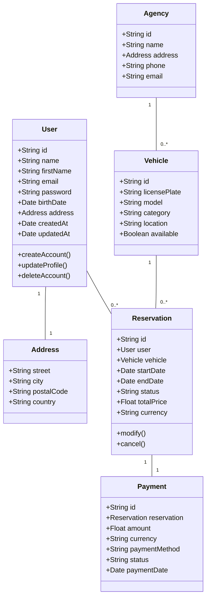
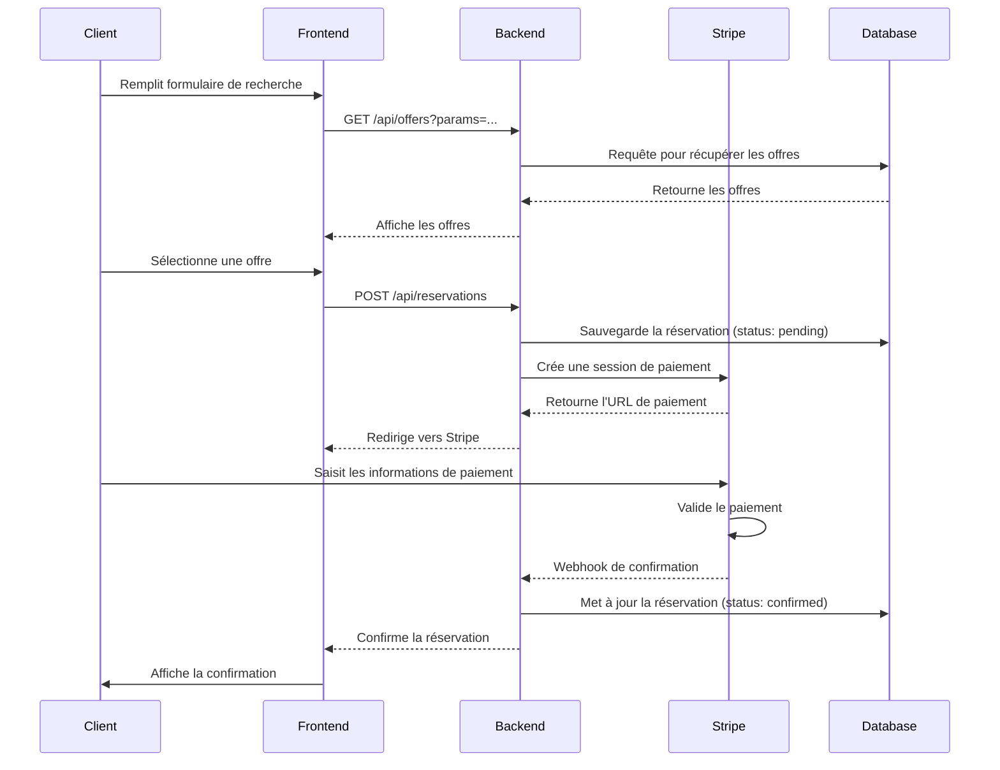

# CAHIER DES CHARGES - Your Car Your Way (V1.2)

*Mise à jour : 02/07/2026*

---

## **SOMMAIRE**

- [Objet du document](#objet-du-document)
- [Contexte](#contexte)
- [Périmètre](#périmètre)
- [Liste des fonctionnalités](#liste-des-fonctionnalités)
- [Exigences particulières](#exigences-particulières)
- [Profils et situations d’usage](#profils-et-situations-dusage)
- [Besoins utilisateurs consolidés](#besoins-utilisateurs-consolidés)
- [Règles métier consolidées](#règles-métier-consolidées)
- [Exigences transverses](#exigences-transverses)
- [User stories et critères d’acceptation](#user-stories-et-critères-dacceptation)
- [Modélisation](#modélisation)
- [Points à clarifier](#points-à-clarifier)

---

## **Objet du document**

Le document « Cahier des Charges » liste les fonctionnalités à implémenter pour le projet **Your Car Your Way**. Ces fonctionnalités sont exprimées du point de vue métier sous la forme d’actions que l’utilisateur peut effectuer sur l’application. Cette version **V1.2** intègre les corrections et compléments identifiés pour répondre aux exigences du projet, notamment en matière d’**accessibilité (RGAA)**, d’**internationalisation**, de **sécurité**, et de **modélisation technique**. 

---

## **Contexte**

**Your Car Your Way** est une entreprise de location de voitures présente à l’international. Les clients utilisent actuellement des applications web disparates, développées avec des technologies hétérogènes (Java EE, PHP Laravel, Node.js, Angular), déployées sur des infrastructures variées (OVH, AWS, Azure). Ces applications souffrent de **problèmes de maintenabilité, de performance et d’évolutivité**, avec des pratiques de sécurité inégales et des taux de fiabilité variables.

Pour remédier à ces problèmes, l’entreprise souhaite **centraliser ses applications** en une seule solution unifiée, **scalable**, **sécurisée** et **conforme aux normes d’accessibilité (RGAA 4.1)**. Cette nouvelle application devra également répondre aux enjeux d’**internationalisation** et d’**impact écologique**. 

---

## **Périmètre**

Les fonctionnalités décrites dans ce document concernent la **première version de la nouvelle application centralisée Your Car Your Way**. Cette application sera déployée à l’international et utilisée par tous les clients de l’entreprise.

Elle est **destinée aux clients** et ne concerne pas les actions réalisées par les employés en agence (qui interagiront avec l’application via une **API dédiée**).

---

## **Liste des fonctionnalités**

### **1. Gestion du compte**

- Consulter son profil via la page de profil.
- Modifier ses informations personnelles (nom, prénom, date de naissance, adresse) via la page de profil.
- **Créer un compte** (nouveau) :
  - Saisie des informations personnelles (nom, prénom, email, mot de passe, date de naissance, adresse).
  - Validation de l’email via un lien de confirmation.
  - Respect des exigences RGAA (formulaire accessible au clavier et compatible avec les lecteurs d’écran).
- Supprimer son compte (avec confirmation par mot de passe).
- **Authentification** (nouveau) :
  - Connexion via email + mot de passe.
  - Option **2FA (Double Facteur d’Authentification)** pour renforcer la sécurité.
  - Gestion des sessions (JWT ou OAuth 2.0).

### **2. Gestion des locations de voitures**

- Consulter la liste des agences de location.
- Afficher les offres de location après avoir rempli un formulaire de recherche avec les critères suivants :
  - Ville de départ et ville de retour.
  - Date et heure de début, date et heure de retour.
  - Catégorie du véhicule (norme **ACRISS**).
- Consulter le détail d’une offre de location.
- Réserver une location correspondant à une offre, incluant :
  - Fournir ses informations personnelles (récupérables depuis le profil si disponibles).
  - Effectuer le paiement via un **fournisseur externe (Stripe, PayPal, Alipay selon le pays)**.
- Consulter l’historique de ses réservations (passées et en cours).
- **Modifier une réservation** (possible jusqu’à 48h avant le début).
- **Annuler une réservation** avec application des règles de remboursement.

### **3. Internationalisation** *(Nouvelle section)*

- **Support des langues** : FR, EN, ES, DE, et autres selon les marchés.
- **Gestion des devises** : EUR, USD, CAD, GBP, etc. (conversion automatique selon la localisation).
- **Fuseaux horaires** : UTC + synchronisation automatique avec le fuseau horaire de l’utilisateur.
- **Traductions dynamiques** : Libellés, messages d’erreur, et informations affichées adaptés à la langue de l’interface.

---

## **Exigences particulières**

### **Règles métier**

- **Modification d’une réservation** : Possible jusqu’à **48h avant le début** de la location.
- **Annulation d’une réservation** :
  - **> 7 jours avant** : Remboursement à **100%**. 
  - **< 7 jours avant** : Remboursement limité à **25%** du montant total.
  - **< 48h avant** : **Aucun remboursement**, modification impossible.
- **Paiement externalisé** : Intégration avec des fournisseurs de paiement en ligne (Stripe, PayPal, Alipay, etc.).
- **Norme ACRISS** : Utilisée pour les catégories de véhicules.
- **Suppression du compte** : Nécessite la saisie du mot de passe pour confirmation.
- **API pour les agences** : Les applications en agence doivent pouvoir **consulter et modifier** les données via une API offrant les opérations **CRUD** (Create, Read, Update, Delete) sur les domaines concernés (utilisateurs, réservations, véhicules, etc.).

### **Audit de l’existant** *(Nouvelle section)*

L’entreprise dispose actuellement de **4 applications monolithiques** développées avec des technologies hétérogènes :

| **Application**      | **Technologie** | **Infrastructure** | **Forces**                     | **Faiblesses**                             |
| -------------------- | --------------- | ------------------ | ------------------------------ | ------------------------------------------ |
| App Europe           | Java EE         | OVH                | Stabilité, maturité            | Maintenance coûteuse, peu scalable         |
| App Amérique du Nord | PHP Laravel     | AWS                | Flexibilité, communauté active | Performances variables, sécurité inégale   |
| App Asie             | Node.js         | Azure              | Modernité, évolutivité         | Complexité de déploiement                  |
| App Mobile           | Angular         | OVH                | Interface utilisateur riche    | Intégration difficile avec les autres apps |

**Problématiques identifiées** :

- **Fragmentation** : Données isolées, pas de synchronisation entre les applications.
- **Maintenabilité** : Coûts élevés, temps d’indisponibilité fréquents.
- **Sécurité** : Pratiques inégales (SHA-1, bcrypt, argon2id).
- **Accessibilité** : Peu ou pas de conformité RGAA.

**Justification de la refonte** :

- **Centralisation** : Unifier les données et les processus métier.
- **Scalabilité** : Passer à une **architecture microservices** pour remplacer les monolithes.
- **Sécurité** : Standardiser les pratiques (chiffrement bcrypt, OAuth 2.0).
- **Accessibilité** : Conformité RGAA 4.1 pour tous les utilisateurs.

---

## **Profils et situations d’usage**

### **1. Client consultant les offres**

- Consulter la liste des agences de location.
- Rechercher des offres de location selon des critères de ville, date, heure et catégorie de véhicule.
- Consulter le détail d’une offre de location.

### **2. Client disposant d’un compte**

- Consulter son profil.
- Modifier ses informations personnelles.
- **Créer un compte** (nouveau).
- Réserver une location.
- Consulter l’historique de ses réservations.
- Modifier ou annuler une réservation selon les règles prévues.
- Supprimer son compte.

### **3. Client en situation de handicap (PSH)**

- Accéder aux mêmes fonctionnalités que les autres clients.
- Utiliser l’application dans des conditions **compatibles RGAA 4.1** :
  - Navigation au clavier.
  - Compatibilité avec les lecteurs d’écran (NVDA, JAWS).
  - Messages d’erreur et informations vocalisés.
  - Contraste des couleurs respectant un ratio de **4.5:1**.

### **4. Applications utilisées en agence**

- Consulter les données traitées par l’application client via une **API dédiée**.
- Modifier ces données via l’API (opérations CRUD).

---

## **Besoins utilisateurs consolidés**

- Pouvoir **créer un compte** et s’authentifier de manière sécurisée.
- Pouvoir rechercher une offre de location correspondant à un besoin de déplacement.
- Pouvoir comparer et consulter les informations d’une offre avant réservation.
- Pouvoir réserver une offre en renseignant les informations nécessaires et en effectuant un paiement.
- Pouvoir retrouver ses réservations passées et en cours.
- Pouvoir modifier ou annuler une réservation dans le respect des règles métier.
- Pouvoir gérer ses informations personnelles depuis son profil.
- Pouvoir supprimer son compte selon un parcours sécurisé.
- Pouvoir utiliser le service dans un **contexte international** (langues, devises, fuseaux horaires).
- Pouvoir accéder au service dans des conditions **compatibles RGAA 4.1**.

---

## **Règles métier consolidées**

- Une offre de location est définie par :
  - Une ville de départ et une ville de retour.
  - Une date et une heure de début, une date et une heure de retour.
  - Une catégorie de véhicule (norme ACRISS).
  - Un tarif (en devise locale).
- **Modification** : Possible jusqu’à 48h avant le début de la réservation.
- **Annulation** :
  - > 7 jours avant : **100% remboursé**.
  - < 7 jours avant : **25% remboursé**.
  - < 48h avant : **0% remboursé**, modification impossible.
- **Paiement** : Externalisé auprès d’un fournisseur de service de paiement en ligne.
- **Catégories de véhicule** : Norme ACRISS.
- **Suppression du compte** : Nécessite la saisie du mot de passe.
- **API pour les agences** : Opérations CRUD standard sur les domaines concernés.

---

## **Exigences transverses**

### **1. Accessibilité (RGAA 4.1)**

**Objectif** : Rendre l’application accessible à tous, y compris aux **personnes en situation de handicap (PSH)**.

#### **Critères RGAA applicables**

- **Navigation** : Tous les parcours principaux doivent être réalisables **uniquement au clavier**.
- **Formulaires** :
  - Chaque champ doit avoir un **label associé** (balise `<label>`).
  - Les messages d’erreur doivent être **explicites et vocalisés** par les lecteurs d’écran.
- **Images** : Chaque image doit avoir une **alternative textuelle** (`alt`).
- **Contraste** : Ratio minimal de **4.5:1** pour les textes et éléments interactifs.
- **Lecteurs d’écran** :
  - Les informations ne doivent pas reposer **uniquement sur la couleur**.
  - Les étapes des parcours (ex. : réservation) doivent être **compréhensibles** sans repère visuel.
- **Compatibilité** : Testé avec **NVDA**, **JAWS**, et **VoiceOver**.

#### **Exemples concrets**

- **Formulaire de réservation** :
  - Champs accessibles au clavier (tabulation logique).
  - Messages d’erreur annoncés vocalement.
- **Historique des réservations** :
  - Tableau avec en-têtes (`<th>`) pour une lecture claire par les lecteurs d’écran.
  - Couleurs + icônes pour distinguer les statuts (ex. : ✅ pour confirmé, ❌ pour annulé).

### **2. Sécurité**

- **Authentification** :
  - Mot de passe **chiffré en bcrypt**.
  - Option **2FA** (ex. : code SMS ou application comme Google Authenticator).
  - **JWT** ou **OAuth 2.0** pour la gestion des sessions.
- **Paiement** : Externalisé (Stripe, PayPal, etc.) avec **chiffrement PCI DSS**.
- **API** :
  - **OAuth 2.0** pour l’authentification des applications en agence.
  - **HTTPS** obligatoire pour toutes les requêtes.
- **Données sensibles** : Chiffrement en base de données (ex. : numéros de carte bancaire non stockés).
- **Gestion des secrets** : Variables d’environnement (`.env`) pour les clés API.

### **3. Internationalisation**

- **Langues** : Support de FR, EN, ES, DE, avec possibilité d’ajout.
- **Devises** : Conversion automatique selon la localisation (ex. : EUR → USD).
- **Fuseaux horaires** : Synchronisation automatique avec le fuseau horaire de l’utilisateur.
- **Traductions** :
  - Libellés, messages d’erreur, et informations dynamiques traduits.
  - Utilisation d’une **librairie de traduction** (ex. : i18next pour le frontend).

### **4. Impact écologique** *(Nouvelle section)*

- **Hébergement** : Choix d’un **hébergeur vert** (ex. : OVH, GreenWeb).
- **Optimisation** :
  - **Cache** pour les requêtes API fréquentes.
  - **Pagination** pour limiter le nombre de résultats retournés.
  - **Compression des images** pour réduire la taille des pages.
- **Bonnes pratiques** :
  - Limiter les requêtes inutiles.
  - Utiliser des **CDN** pour les ressources statiques.

---

## **User stories et critères d’acceptation**

### **1. Gestion du compte**

#### **US-01 - Consultation du profil**

En tant que client disposant d’un compte, je veux consulter mon profil afin d’accéder à mes informations personnelles.

**Critères d’acceptation** :

- Étant donné un client disposant d’un compte, quand il accède à la page de profil, alors il peut consulter ses informations personnelles.
- Étant donné un client utilisant un lecteur d’écran, quand il consulte son profil, alors les informations sont vocalisées de manière claire.

---

#### **US-02 - Modification du profil**

En tant que client disposant d’un compte, je veux modifier mes informations personnelles afin de maintenir mon profil à jour.

**Critères d’acceptation** :

- Étant donné un client disposant d’un compte, quand il modifie son nom, son prénom, sa date de naissance ou son adresse depuis la page de profil, alors les nouvelles informations sont prises en compte.
- Étant donné un client naviguant au clavier, quand il modifie son profil, alors il peut atteindre et remplir tous les champs sans souris.

---

#### **US-03 - Suppression du compte**

En tant que client disposant d’un compte, je veux supprimer mon compte afin de ne plus utiliser le service.

**Critères d’acceptation** :

- Étant donné un client disposant d’un compte, quand il demande la suppression de son compte, alors la saisie de son mot de passe est requise.
- Étant donné un client naviguant au clavier ou à l’aide d’un lecteur d’écran, quand il demande la suppression de son compte, alors il peut comprendre l’action demandée, saisir son mot de passe et confirmer l’opération.

---

#### **US-14 - Création de compte** *(Nouveau)*

En tant que nouveau client, je veux créer un compte afin d’accéder aux fonctionnalités de réservation et de gestion de profil.

**Critères d’acceptation** :

- Étant donné un nouveau client, quand il remplit le formulaire de création de compte avec des informations valides (email, mot de passe, nom, prénom, date de naissance, adresse), alors son compte est créé et un email de confirmation lui est envoyé.
- Étant donné un client utilisant un lecteur d’écran, quand il remplit le formulaire de création de compte, alors tous les champs et messages d’erreur sont vocalisés.
- Étant donné un client naviguant au clavier, quand il remplit le formulaire, alors il peut atteindre et remplir tous les champs sans souris.
- Le mot de passe doit respecter des critères de complexité (ex. : 8 caractères minimum, 1 majuscule, 1 chiffre).

---

#### **US-15 - Authentification** *(Nouveau)*

En tant que client, je veux me connecter à mon compte afin d’accéder à mes réservations et à mon profil.

**Critères d’acceptation** :

- Étant donné un client avec un compte existant, quand il saisit son email et son mot de passe valides, alors il est authentifié et redirigé vers son espace personnel.
- Étant donné un client avec le 2FA activé, quand il saisit son code de vérification, alors il accède à son compte.
- Étant donné un client utilisant un lecteur d’écran, quand il se connecte, alors les messages d’erreur (ex. : mot de passe incorrect) sont vocalisés.

---

### **2. Gestion d’une location de voitures**

#### **US-04 - Consultation des agences**

En tant que client, je veux consulter la liste des agences de location afin d’identifier les points de départ et de retour disponibles.

**Critères d’acceptation** :

- Étant donné un client, quand il consulte les agences de location, alors la liste des agences est affichée avec leurs adresses et horaires.

---

#### **US-05 - Recherche d’offres de location**

En tant que client, je veux afficher les offres de location à partir de critères de recherche afin de trouver une offre adaptée à mon besoin.

**Critères d’acceptation** :

- Étant donné un client, quand il renseigne une ville de départ, une ville de retour, une date et une heure de début, une date et une heure de retour et une catégorie de véhicule, alors les offres de location correspondantes sont affichées.
- Étant donné un client naviguant au clavier, quand il utilise le formulaire de recherche, alors il peut atteindre et renseigner tous les champs sans souris.
- Étant donné un client utilisant un lecteur d’écran, quand il utilise le formulaire de recherche, alors les champs, leurs libellés et les messages associés sont compréhensibles.

---

#### **US-06 - Consultation du détail d’une offre**

En tant que client, je veux consulter le détail d’une offre de location afin de vérifier qu’elle correspond à mon besoin.

**Critères d’acceptation** :

- Étant donné une offre de location, quand le client consulte son détail, alors il peut accéder aux informations de l’offre (prix, véhicule, dates, etc.).
- Étant donné un client utilisant un lecteur d’écran, quand il consulte le détail d’une offre, alors il peut accéder aux informations essentielles de l’offre de manière compréhensible.

---

#### **US-07 - Réservation d’une location**

En tant que client, je veux réserver une offre de location afin de confirmer ma location.

**Critères d’acceptation** :

- Étant donné une offre de location, quand le client effectue une réservation, alors il peut fournir ses informations personnelles.
- Étant donné une réservation, quand les informations du profil sont présentes, alors elles peuvent être récupérées depuis le profil.
- Étant donné une réservation, quand le client valide le parcours de paiement, alors le paiement est effectué via un fournisseur externe (Stripe, PayPal, etc.).
- Étant donné un client naviguant au clavier ou à l’aide d’un lecteur d’écran, quand il effectue une réservation, alors il peut comprendre les étapes du parcours, renseigner les informations demandées et identifier les actions à réaliser.

---

#### **US-08 - Consultation de l’historique des réservations**

En tant que client disposant d’un compte, je veux consulter l’historique de mes réservations afin de retrouver mes réservations passées et en cours.

**Critères d’acceptation** :

- Étant donné un client disposant d’un compte, quand il consulte son historique, alors ses réservations passées et en cours sont affichées.
- Étant donné un client naviguant au clavier ou à l’aide d’un lecteur d’écran, quand il consulte son historique, alors il peut parcourir ses réservations et distinguer les informations utiles sans dépendre d’un code couleur seul.

---

#### **US-09 - Modification d’une réservation**

En tant que client disposant d’une réservation, je veux modifier ma réservation afin de l’adapter à mon besoin dans le respect des règles prévues.

**Critères d’acceptation** :

- Étant donné une réservation, quand le client demande une modification **plus de 48h avant son début**, alors la modification est possible.
- Étant donné une réservation, quand le client demande une modification **moins de 48h avant son début**, alors la modification n’est pas possible et un message l’informe.

---

#### **US-10 - Annulation d’une réservation**

En tant que client disposant d’une réservation, je veux annuler ma réservation afin de renoncer à la location.

**Critères d’acceptation** :

- Étant donné une réservation, quand le client l’annule **à plus de 7 jours de son début**, alors le remboursement est de **100%**.
- Étant donné une réservation, quand le client l’annule **à moins de 7 jours de son début**, alors le remboursement est limité à **25%** du montant total.
- Étant donné une réservation, quand le client l’annule **à moins de 48h de son début**, alors **aucun remboursement** n’est effectué.

---

### **3. Intégration avec les applications d’agence**

#### **US-11 - Consultation des données via API**

En tant qu’application utilisée en agence, je veux consulter les données traitées par l’application client afin d’exploiter les informations nécessaires en agence.

**Critères d’acceptation** :

- Étant donné une application utilisée en agence, quand elle appelle l’API dédiée avec une authentification valide (OAuth 2.0), alors elle peut consulter les données des domaines concernés (utilisateurs, réservations, véhicules).

---

#### **US-12 - Modification des données via API**

En tant qu’application utilisée en agence, je veux modifier les données traitées par l’application client afin d’assurer les opérations nécessaires en agence.

**Critères d’acceptation** :

- Étant donné une application utilisée en agence, quand elle appelle l’API dédiée avec une authentification valide, alors elle peut utiliser des opérations **CRUD** standard sur les domaines concernés.

---

### **4. Internationalisation**

#### **US-13 - Affichage dans la langue de l’interface**

En tant que client, je veux consulter l’interface dans une langue adaptée afin de comprendre les informations, les labels et les actions affichées.

**Critères d’acceptation** :

- Étant donné un client utilisant une langue d’interface donnée (ex. : FR, EN), quand il consulte l’application, alors les labels et les textes affichés sont présentés dans cette langue.
- Étant donné un client utilisant une langue d’interface donnée, quand il consulte un formulaire ou un parcours, alors les messages, aides et informations affichées sont cohérents avec cette langue.

---

## **Modélisation**

### **1. Diagramme de classes**

---

### **2. Diagramme de séquence (Réservation)**

---

### **3. Schéma d’API (Endpoints principaux)**

<mui:table-metadata title=